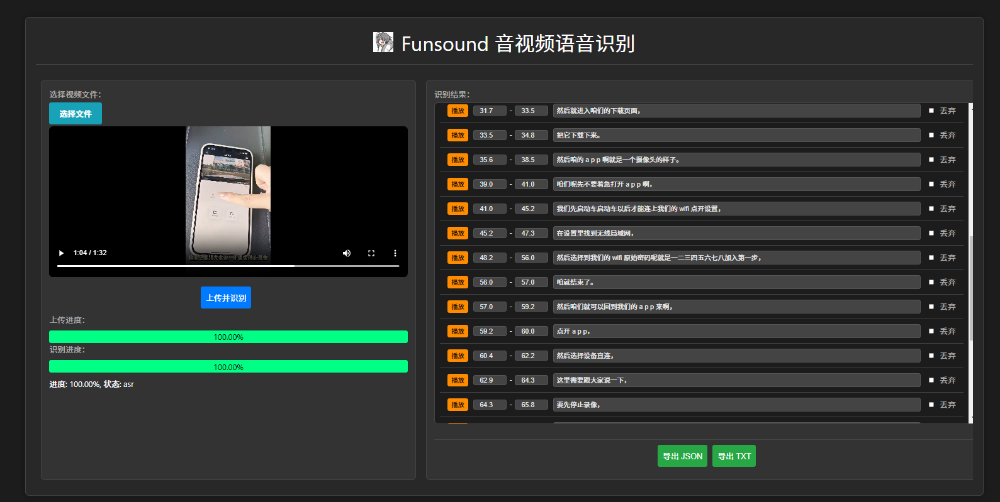

# Funsound: 基于FunAsr的多路语音识别转写网页


## 安装
```shell
    pip install -U funasr
    pip install -U funasr-onnx
    pip install -U modelscope
    # 其他依赖请参考 funsound.utils 的导入项
```

## 网站展示
> 网址：www.funsound.cn



支持：
 - 多路语音并发转写
 - asr断句试听
 - 手动纠正 和 识别结果导出

 ## 网站应用
 > python -m funsound.http.Server_http_asr

## 联系作者
> 邮箱：605686962@qq.com


